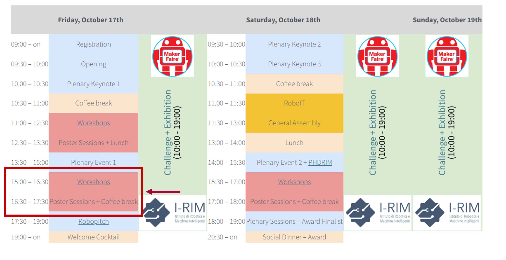

=======
Program
=======

The workshop will take place on **Friday the 17th**, 2025, in **Aula 21**, time **15.00-17.30**.

The workshop will host 6 keynote speech of 12 minutes each, and 3 minutes for the Q&A from the audience.

After the 90 minute keynote session, there will be an hour of presentations of extended abstract submitted to the workshop.

Keynotes
========

Learn more about the speakers at the dedicated page :ref:`speakers`!

+----------------+--------------------+--------------------------------------------------------------------------------------+
| Time           | Speaker            | Title                                                                                |
+================+====================+======================================================================================+
| —              | Organisers         | Workshop introduction and overview                                                   |
+----------------+--------------------+--------------------------------------------------------------------------------------+
| 15.00 - 15.15  | Stefano Ghidoni    | Multi-view environment perception for efficient human-robot interaction              |
+----------------+--------------------+--------------------------------------------------------------------------------------+
| 15.15 - 15.30  | Riccardo Caccavale | Cognitive Control and Executive Attention for Collaborative Robotics in Industry 5.0 |
+----------------+--------------------+--------------------------------------------------------------------------------------+
| 15.30 - 15.45  | Francesca Negrello | Between research and industry: experiences from the field                            |
+----------------+--------------------+--------------------------------------------------------------------------------------+
| 15.45 - 16.00  | Marco Todescato    | Robotics picking: an applied research perspective                                    |
+----------------+--------------------+--------------------------------------------------------------------------------------+
| 16.00 - 16.15  | —                  | Next Generation Robotics                                                             |
+----------------+--------------------+--------------------------------------------------------------------------------------+
| 16.15 - 16.30  | Marco Bolignari    | —                                                                                    |
+----------------+--------------------+--------------------------------------------------------------------------------------+

Extended abstract presentations
===============================

Each accepted extended abstract has 1 minute lightning talk to introduce and promote their work.
For enhanced and thorough discussion, a poster presentation will follow.

+----------------+----------------------------------+
| Time           |                                  |
+================+==================================+
| 16.30 - 16.45  | Lighting abstract presentation   |
+----------------+----------------------------------+
| 16.45 - 17.30  | Poster presentation              |
+----------------+----------------------------------+

List of presented works:

- *A Handheld Tactile Perception Device Enabling Defect Detection for Quality Inspection*, Michele Pompilio, Gionata Salvietti, Enrico Turco, Nicole D'Aurizio and Domenico Prattichizzo;
- *Hierarchical Path Planning for Multi-Robot Systems*, Marianna Turrà, Silvia Proia, Alessandro Bonetti and Lorenzo Sabattini;
- *Exploiting redundancy for jerk minimization in robotic manipulators*, Giuliano Fabris, Lorenzo Scalera, Paolo Boscariol and Alessandro Gasparetto;
- *Two-loop decentralized admittance control for a multi-manipulator system*, Graziano Carriero, Monica Sileo, Francesco Pierri, Sebastiano Fregnan, Marko Guberina, Yiannis Karayiannidis and Fabrizio Caccavale;
- *The Traveling Salesman Problem in parallel robotics: definitions, optimization and performance*, Giovanni Mottola, Pietro Davide Maddio, Alessandro Cammarata, Rosario Sinatra and Francesca Garescì;
- *Exploring Supervised and Unsupervised Learning with 1D Autoencoders: Three Case Studies*, Adriano Liso and Vito Renò;
- *Unilateral Telemanipulation System For Operator-Centered Training And Control In Industrial Robotics*, Mattia Tafuri, Davide Chiaravalli, Mona Saber Gharamaleki, Claudio Melchiorri, Gianluca Palli and Roberto Meattini;
- *Analytic Collision Costs for STOMP: A Geometry-Informed Framework for Manipulator Motion Planning*, Fabio Mastromarino, Raffaele Carli and Mariagrazia Dotoli;
- *Test4You: An LLM-based Framework for Enhancing the Software Testing Process*, Vincenzo Suriani, Monica Sileo and Domenico Bloisi;
- *Ergodic control for active sensing of 2D Euclidean surfaces*, Veronica Campana, Andrea Del Prete, Luigi Palopoli and Daniele Fontanelli.

Useful links
============

- `List of all workshops at I-RIM 3D <https://i-rim.it/it/workshops-e-extended-abstracts/>`_
- `Final program of I-RIM 3D <https://easychair.org/smart-program/IRIM-3D2025/index.html>`_
